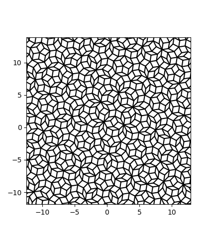

# Table of Contents

1.  [Purpose](#org27c6125)
2.  [Compilation](#org4f17fc8)
3.  [Usage](#org2f4073b)

# Purpose

To generate a 2D Penrose tiling  from a high-dimension projection
method.

# Compilation

Type "make".

# Usage

Type "./test" and then "./viewsites.py"

